- 常见运动模型

  > 速度常量模型只能预测沿直线运动的物体，但是现实中是有很多不是沿直线运动的，下面的几个模型可以预测曲线。
  >
  > - constant turn rate and velocity magnitude model (CTRV)
  > - constant turn rate and acceleration (CTRA)
  > - constant steering angle and velocity (CSAV)
  > - constant curvature and acceleration (CCA)

- 我们使用CTRV模型

  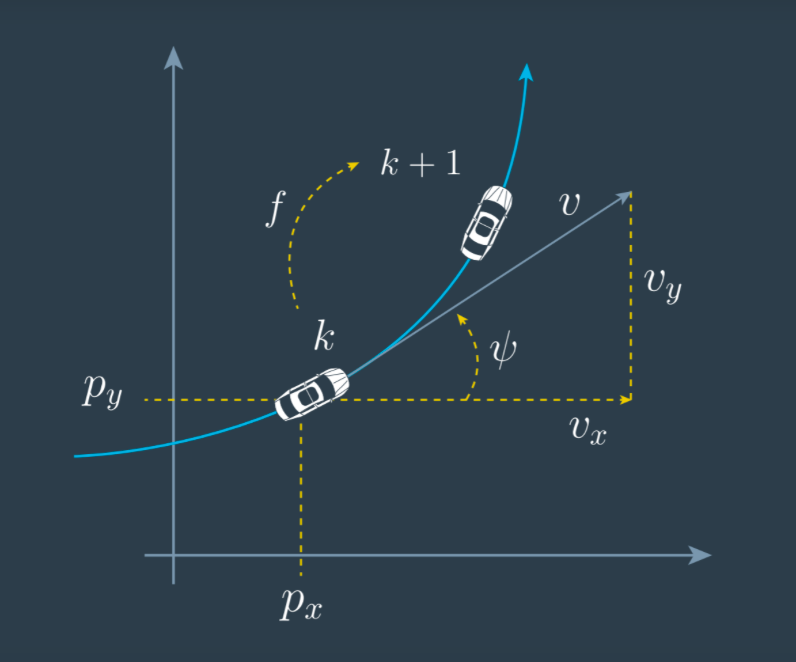

  > 用到的向量如下，其中px，py表示为所在位置，v表示速度大小，ψ表示便航角（就是与x轴的夹角），ψ˙表示角速度。
  >
  > 注意：偏航角，角速度，角速度加速度的关系。

  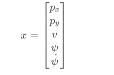

- CTRV模型的微方程

  > 因为CTRV模型的偏航角度变化率和速度是恒定的，所以ψ˙和v的变化率都是0。
  >
  > 根据变化率在时间t上求积分，就能算出xk+1的状态向量。

  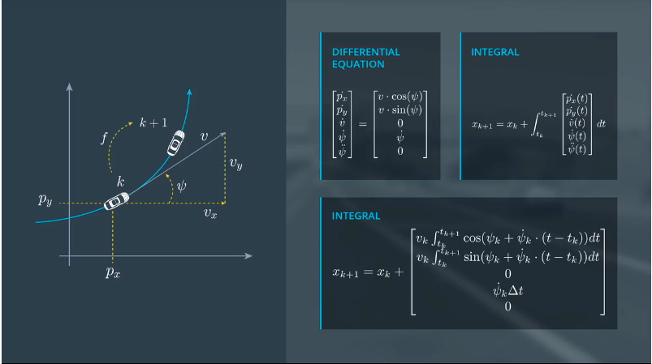

  > 计算上边的积分的时候注意，后面的三项不用求积分，可以直接看出，前两项和时间相关，需要求积分。
  >
  > 结果如下：

  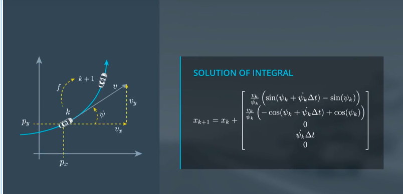

  **注意：当偏航角变化率是0的时候，表示沿直线运动，但是上述方程不能求解此种情况（分母为0），但是我们可以通过，三角关系求出px和py的变化率。**

  1. px的变化率：v * cos(ψ) * Δt
  2. py的变化率：v * sin(ψ) * Δt

- 加入噪声的影响

  噪声包括，角速度的加速度和速度的加速度。由于角速度的加速度对位置的影响较小，忽略。直接计算速度加速度对位置的影响，其实就是常用的运动学公式。

  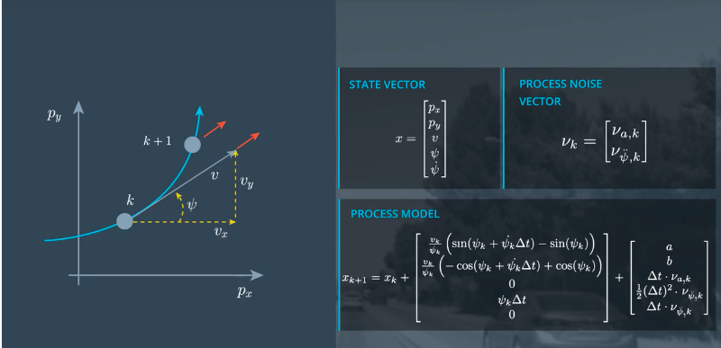

  其中：

  a    =  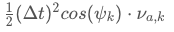

  b    =  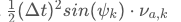

- 无损卡尔曼滤波和扩展卡尔曼滤波的区别

  > 扩展卡尔曼滤波使用线性方程去近似非线性方程，从而结果符合高斯分布，而无损卡尔曼滤波是通过sigma点去近似拟合高斯分布。这两种方法的共同点都是为了满足卡尔曼滤波只能使用于高斯分布的特性。

- 预测（三步）

  1. 选择sigma点

     > λ表示数据点集的离散程度，越大越离散，越小越集中。

     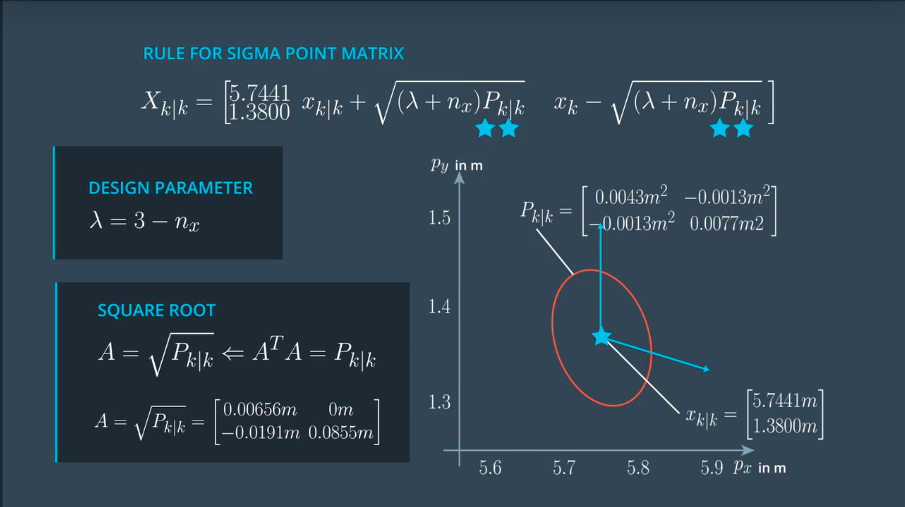

     在c++中实现sigma点的生成：

     ```c++
     #include <iostream>
     #include "ukf.h"

     UKF::UKF() {
       //TODO Auto-generated constructor stub
       Init();
     }

     UKF::~UKF() {
       //TODO Auto-generated destructor stub
     }

     void UKF::Init() {

     }

     void UKF::GenerateSigmaPoints(MatrixXd* Xsig_out) {

       //set state dimension
       int n_x = 5;

       //define spreading parameter
       double lambda = 3 - n_x;

       //set example state
       VectorXd x = VectorXd(n_x);
       x <<   5.7441,
              1.3800,
              2.2049,
              0.5015,
              0.3528;

       //set example covariance matrix
       MatrixXd P = MatrixXd(n_x, n_x);
       P <<     0.0043,   -0.0013,    0.0030,   -0.0022,   -0.0020,
               -0.0013,    0.0077,    0.0011,    0.0071,    0.0060,
                0.0030,    0.0011,    0.0054,    0.0007,    0.0008,
               -0.0022,    0.0071,    0.0007,    0.0098,    0.0100,
               -0.0020,    0.0060,    0.0008,    0.0100,    0.0123;

       //create sigma point matrix
       MatrixXd Xsig = MatrixXd(n_x, 2 * n_x + 1);

       //calculate square root of P
       MatrixXd A = P.llt().matrixL();

       //set first column of sigma point matrix
       Xsig.col(0)  = x;

       //set remaining sigma points
       for (int i = 0; i < n_x; i++)
       {
         Xsig.col(i+1)     = x + sqrt(lambda+n_x) * A.col(i);
         Xsig.col(i+1+n_x) = x - sqrt(lambda+n_x) * A.col(i);
       }
         
       *Xsig_out = Xsig;
     }
     ```

     **注意：由如下方程注意到，噪音向量也是非线形的，所以需要将噪音也考虑到其中，无损卡尔曼滤波中使用了一种简答的方法，只把速度加速度和角速度加速度考虑在其中。**

     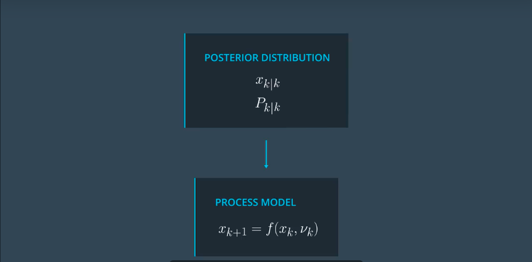

     最终的sigma计算过程如下：

     > 状态向量是一个7维的向量，协方差矩阵P是一个7x7的矩阵，只是在之前协方差的基础上右下角加了Q矩阵（Q矩阵是一个2*2的矩阵）。计算sigma点的公式不变。

     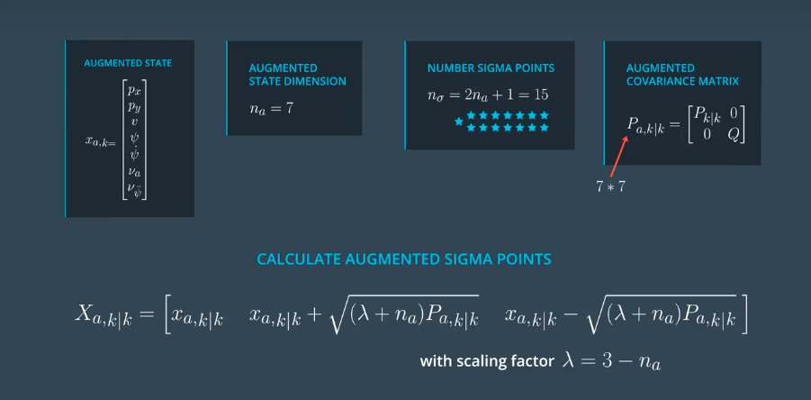

     c++示例代码，跟上边差不多，只是增加了向量的两个维度。

     ```c++
     #include <iostream>
     #include "ukf.h"

     UKF::UKF() {
       //TODO Auto-generated constructor stub
       Init();
     }

     UKF::~UKF() {
       //TODO Auto-generated destructor stub
     }

     void UKF::Init() {

     }

     void UKF::AugmentedSigmaPoints(MatrixXd* Xsig_out) {

       //set state dimension
       int n_x = 5;

       //set augmented dimension
       int n_aug = 7;

       //Process noise standard deviation longitudinal acceleration in m/s^2
       double std_a = 0.2;

       //Process noise standard deviation yaw acceleration in rad/s^2
       double std_yawdd = 0.2;

       //define spreading parameter
       double lambda = 3 - n_aug;

       //set example state
       VectorXd x = VectorXd(n_x);
       x <<   5.7441,
              1.3800,
              2.2049,
              0.5015,
              0.3528;

       //create example covariance matrix
       MatrixXd P = MatrixXd(n_x, n_x);
       P <<     0.0043,   -0.0013,    0.0030,   -0.0022,   -0.0020,
               -0.0013,    0.0077,    0.0011,    0.0071,    0.0060,
                0.0030,    0.0011,    0.0054,    0.0007,    0.0008,
               -0.0022,    0.0071,    0.0007,    0.0098,    0.0100,
               -0.0020,    0.0060,    0.0008,    0.0100,    0.0123;

       //create augmented mean vector
       VectorXd x_aug = VectorXd(7);

       //create augmented state covariance
       MatrixXd P_aug = MatrixXd(7, 7);

       //create sigma point matrix
       MatrixXd Xsig_aug = MatrixXd(n_aug, 2 * n_aug + 1);

       //create augmented mean state
       x_aug.head(5) = x;
       x_aug(5) = 0;
       x_aug(6) = 0;

       //create augmented covariance matrix
       P_aug.fill(0.0);
       // 这个地方是设置P_aug左上角5x5的矩阵内容
       P_aug.topLeftCorner(5,5) = P;
       P_aug(5,5) = std_a*std_a;
       P_aug(6,6) = std_yawdd*std_yawdd;

       //create square root matrix
       MatrixXd L = P_aug.llt().matrixL();

       //create augmented sigma points
       Xsig_aug.col(0)  = x_aug;
       for (int i = 0; i< n_aug; i++)
       {
         Xsig_aug.col(i+1)       = x_aug + sqrt(lambda+n_aug) * L.col(i);
         Xsig_aug.col(i+1+n_aug) = x_aug - sqrt(lambda+n_aug) * L.col(i);
       }
     }
     ```

  2. 预测sigma点

     > 由上一步求得的sigma点，带入到方程，计算预测点。
     >
     > **注意：上一步求得的每个点是7维向量，带入方程之后计算出的是一个5维向量。**

     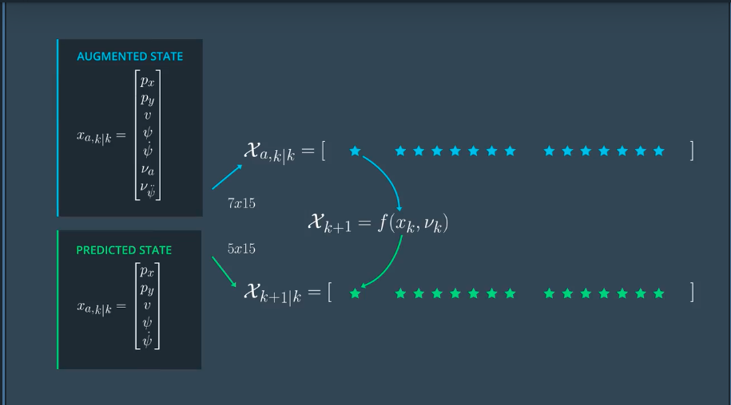

     方程：

     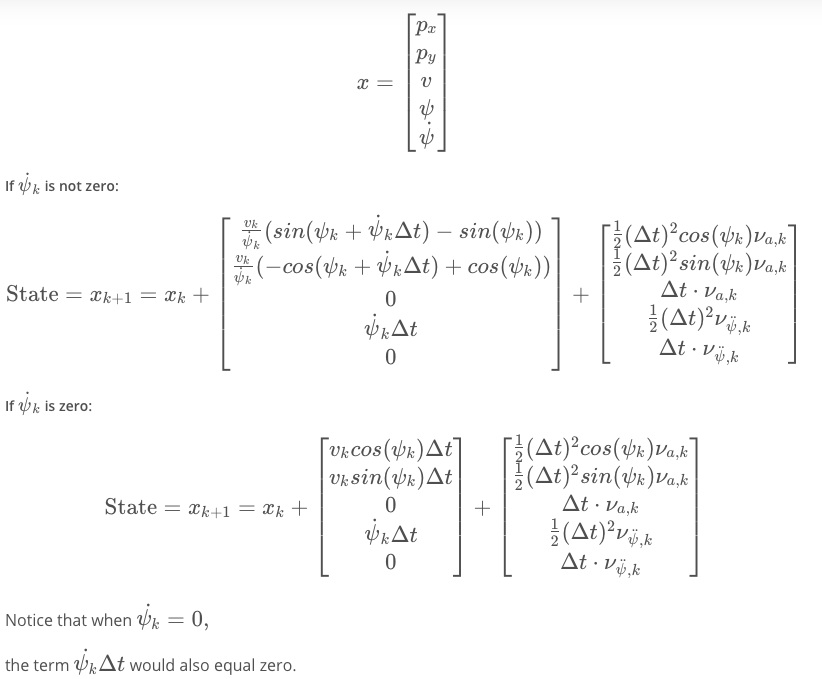

     c++代码示例：

     ```c++
     #include <iostream>
     #include "ukf.h"

     UKF::UKF() {
       //TODO Auto-generated constructor stub
       Init();
     }

     UKF::~UKF() {
       //TODO Auto-generated destructor stub
     }

     void UKF::Init() {

     }

     /*******************************************************************************
     * Programming assignment functions: 
     *******************************************************************************/

     void UKF::SigmaPointPrediction(MatrixXd* Xsig_out) {

       //set state dimension
       int n_x = 5;

       //set augmented dimension
       int n_aug = 7;

       //create example sigma point matrix
       MatrixXd Xsig_aug = MatrixXd(n_aug, 2 * n_aug + 1);
          Xsig_aug <<
         5.7441,  5.85768,   5.7441,   5.7441,   5.7441,   5.7441,   5.7441,   5.7441,   5.63052,   5.7441,   5.7441,   5.7441,   5.7441,   5.7441,   5.7441,
           1.38,  1.34566,  1.52806,     1.38,     1.38,     1.38,     1.38,     1.38,   1.41434,  1.23194,     1.38,     1.38,     1.38,     1.38,     1.38,
         2.2049,  2.28414,  2.24557,  2.29582,   2.2049,   2.2049,   2.2049,   2.2049,   2.12566,  2.16423,  2.11398,   2.2049,   2.2049,   2.2049,   2.2049,
         0.5015,  0.44339, 0.631886, 0.516923, 0.595227,   0.5015,   0.5015,   0.5015,   0.55961, 0.371114, 0.486077, 0.407773,   0.5015,   0.5015,   0.5015,
         0.3528, 0.299973, 0.462123, 0.376339,  0.48417, 0.418721,   0.3528,   0.3528,  0.405627, 0.243477, 0.329261,  0.22143, 0.286879,   0.3528,   0.3528,
              0,        0,        0,        0,        0,        0,  0.34641,        0,         0,        0,        0,        0,        0, -0.34641,        0,
              0,        0,        0,        0,        0,        0,        0,  0.34641,         0,        0,        0,        0,        0,        0, -0.34641;

       //create matrix with predicted sigma points as columns
       MatrixXd Xsig_pred = MatrixXd(n_x, 2 * n_aug + 1);

       double delta_t = 0.1; //time diff in sec
     /*******************************************************************************
      * Student part begin
      ******************************************************************************/

       //predict sigma points
       for (int i = 0; i< 2*n_aug+1; i++)
       {
         //extract values for better readability
         double p_x = Xsig_aug(0,i);
         double p_y = Xsig_aug(1,i);
         double v = Xsig_aug(2,i);
         double yaw = Xsig_aug(3,i);
         double yawd = Xsig_aug(4,i);
         double nu_a = Xsig_aug(5,i);
         double nu_yawdd = Xsig_aug(6,i);

         //predicted state values
         double px_p, py_p;

         //avoid division by zero
         if (fabs(yawd) > 0.001) {
             px_p = p_x + v/yawd * ( sin (yaw + yawd*delta_t) - sin(yaw));
             py_p = p_y + v/yawd * ( cos(yaw) - cos(yaw+yawd*delta_t) );
         }
         else {
             px_p = p_x + v*delta_t*cos(yaw);
             py_p = p_y + v*delta_t*sin(yaw);
         }

         double v_p = v;
         double yaw_p = yaw + yawd*delta_t;
         double yawd_p = yawd;

         //add noise
         px_p = px_p + 0.5*nu_a*delta_t*delta_t * cos(yaw);
         py_p = py_p + 0.5*nu_a*delta_t*delta_t * sin(yaw);
         v_p = v_p + nu_a*delta_t;

         yaw_p = yaw_p + 0.5*nu_yawdd*delta_t*delta_t;
         yawd_p = yawd_p + nu_yawdd*delta_t;

         //write predicted sigma point into right column
         Xsig_pred(0,i) = px_p;
         Xsig_pred(1,i) = py_p;
         Xsig_pred(2,i) = v_p;
         Xsig_pred(3,i) = yaw_p;
         Xsig_pred(4,i) = yawd_p;
       }

     /*******************************************************************************
      * Student part end
      ******************************************************************************/

       //print result
       std::cout << "Xsig_pred = " << std::endl << Xsig_pred << std::endl;

       //write result
       *Xsig_out = Xsig_pred;

     }
     ```

  3. 根据预测的点，计算均值，协方差

     > 注意在计算均值时候的权重w，因为在生成点的时候乘以了

     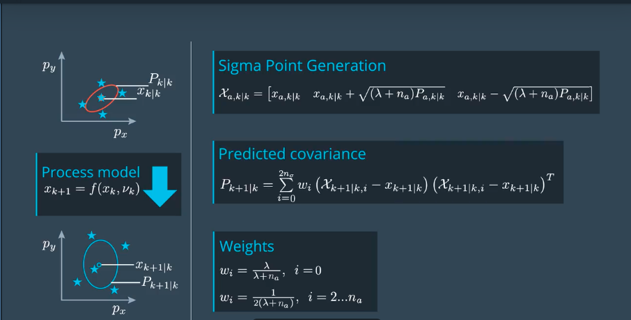

     能用到的方程：

     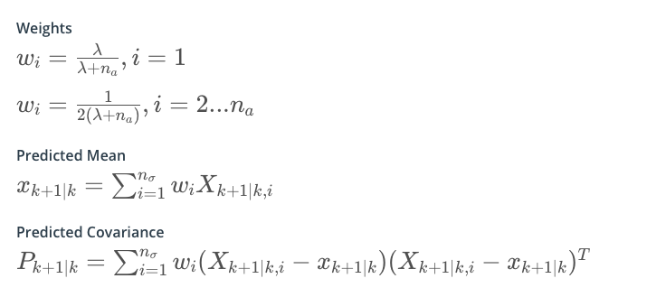

  ```c++
  #include <iostream>
  #include "ukf.h"

  UKF::UKF() {
    //TODO Auto-generated constructor stub
    Init();
  }

  UKF::~UKF() {
    //TODO Auto-generated destructor stub
  }

  void UKF::Init() {

  }

  /*******************************************************************************
  * Programming assignment functions: 
  *******************************************************************************/

  void UKF::PredictMeanAndCovariance(VectorXd* x_out, MatrixXd* P_out) {

    //set state dimension
    int n_x = 5;

    //set augmented dimension
    int n_aug = 7;

    //define spreading parameter
    double lambda = 3 - n_aug;

    //create example matrix with predicted sigma points
    MatrixXd Xsig_pred = MatrixXd(n_x, 2 * n_aug + 1);
    Xsig_pred <<
           5.9374,  6.0640,   5.925,  5.9436,  5.9266,  5.9374,  5.9389,  5.9374,  5.8106,  5.9457,  5.9310,  5.9465,  5.9374,  5.9359,  5.93744,
             1.48,  1.4436,   1.660,  1.4934,  1.5036,    1.48,  1.4868,    1.48,  1.5271,  1.3104,  1.4787,  1.4674,    1.48,  1.4851,    1.486,
            2.204,  2.2841,  2.2455,  2.2958,   2.204,   2.204,  2.2395,   2.204,  2.1256,  2.1642,  2.1139,   2.204,   2.204,  2.1702,   2.2049,
           0.5367, 0.47338, 0.67809, 0.55455, 0.64364, 0.54337,  0.5367, 0.53851, 0.60017, 0.39546, 0.51900, 0.42991, 0.530188,  0.5367, 0.535048,
            0.352, 0.29997, 0.46212, 0.37633,  0.4841, 0.41872,   0.352, 0.38744, 0.40562, 0.24347, 0.32926,  0.2214, 0.28687,   0.352, 0.318159;

    //create vector for weights
    VectorXd weights = VectorXd(2*n_aug+1);
    
    //create vector for predicted state
    VectorXd x = VectorXd(n_x);

    //create covariance matrix for prediction
    MatrixXd P = MatrixXd(n_x, n_x);

  /*******************************************************************************
   * Student part begin
   ******************************************************************************/

    // set weights
    double weight_0 = lambda/(lambda+n_aug);
    weights(0) = weight_0;
    for (int i=1; i<2*n_aug+1; i++) {  //2n+1 weights
      double weight = 0.5/(n_aug+lambda);
      weights(i) = weight;
    }

    //predicted state mean
    x.fill(0.0);
    for (int i = 0; i < 2 * n_aug + 1; i++) {  //iterate over sigma points
      x = x+ weights(i) * Xsig_pred.col(i);
    }

    //predicted state covariance matrix
    P.fill(0.0);
    for (int i = 0; i < 2 * n_aug + 1; i++) {  //iterate over sigma points

      // state difference
      VectorXd x_diff = Xsig_pred.col(i) - x;
      //angle normalization
      while (x_diff(3)> M_PI) x_diff(3)-=2.*M_PI;
      while (x_diff(3)<-M_PI) x_diff(3)+=2.*M_PI;

      P = P + weights(i) * x_diff * x_diff.transpose() ;
    }
       /***************************

  - Student part end
    **************************/
      
  //print result
  std::cout << "Predicted state" << std::endl;
  std::cout << x << std::endl;
  std::cout << "Predicted covariance matrix" << std::endl;
  std::cout << P << std::endl;

  //write result
  *x_out = x;
  *P_out = P;
    }
  ```


  

- 测量

  > 测量方程也是非线形的，和之前的方法类似，也需要计算均值和协方差。
  >
  > 但是和之前不同的是有两个简便方法：
  >
  > 1. 直接使用上面预测出的sigma点集。
  > 2. 不用在测量向量中添加噪声向量，w k+1 设置为0。
  >
  > 下边以雷达测量为例。

  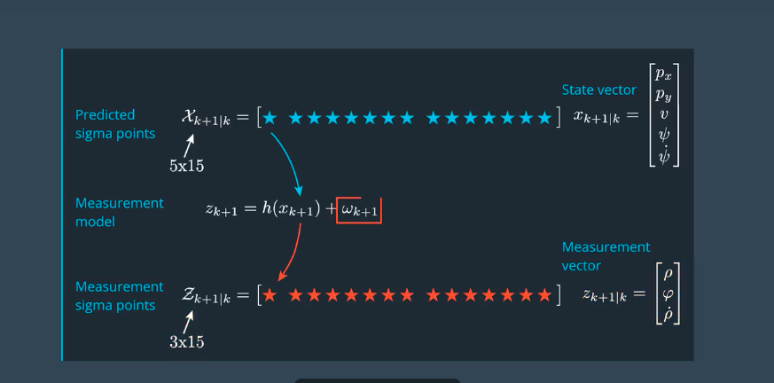

  计算均值和协方差：

  > 因为测量噪声协方差没有非线性效应，所以不用扩展，直接加到协方差测量协方差后面。

  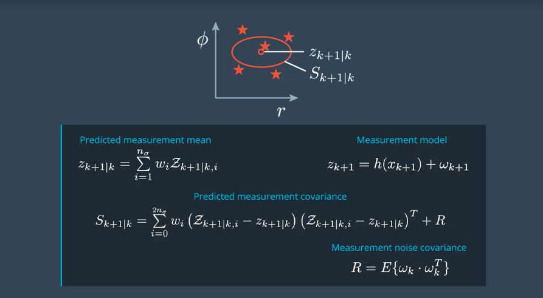

  用到的公式：

  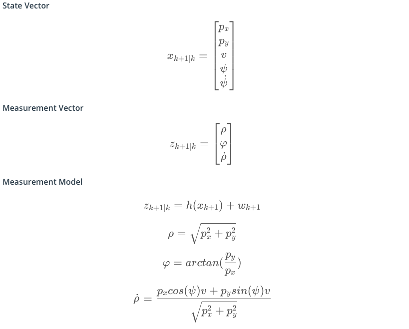

  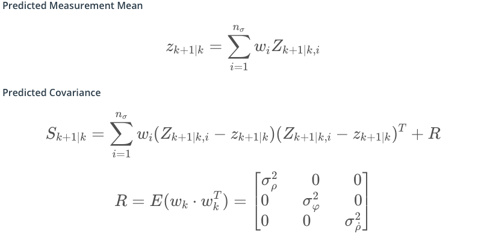


  ```c++
  #include <iostream>
  #include "ukf.h"

  UKF::UKF() {
    //TODO Auto-generated constructor stub
    Init();
  }

  UKF::~UKF() {
    //TODO Auto-generated destructor stub
  }

  void UKF::Init() {

  }

  /*******************************************************************************
  * Programming assignment functions: 
  *******************************************************************************/

  void UKF::PredictRadarMeasurement(VectorXd* z_out, MatrixXd* S_out) {

    //set state dimension
    int n_x = 5;

    //set augmented dimension
    int n_aug = 7;

    //set measurement dimension, radar can measure r, phi, and r_dot
    int n_z = 3;

    //define spreading parameter
    double lambda = 3 - n_aug;

    //set vector for weights
    VectorXd weights = VectorXd(2*n_aug+1);
     double weight_0 = lambda/(lambda+n_aug);
    weights(0) = weight_0;
    for (int i=1; i<2*n_aug+1; i++) {  
      double weight = 0.5/(n_aug+lambda);
      weights(i) = weight;
    }

    //radar measurement noise standard deviation radius in m
    double std_radr = 0.3;

    //radar measurement noise standard deviation angle in rad
    double std_radphi = 0.0175;

    //radar measurement noise standard deviation radius change in m/s
    double std_radrd = 0.1;

    //create example matrix with predicted sigma points
    MatrixXd Xsig_pred = MatrixXd(n_x, 2 * n_aug + 1);
    Xsig_pred <<
           5.9374,  6.0640,   5.925,  5.9436,  5.9266,  5.9374,  5.9389,  5.9374,  5.8106,  5.9457,  5.9310,  5.9465,  5.9374,  5.9359,  5.93744,
             1.48,  1.4436,   1.660,  1.4934,  1.5036,    1.48,  1.4868,    1.48,  1.5271,  1.3104,  1.4787,  1.4674,    1.48,  1.4851,    1.486,
            2.204,  2.2841,  2.2455,  2.2958,   2.204,   2.204,  2.2395,   2.204,  2.1256,  2.1642,  2.1139,   2.204,   2.204,  2.1702,   2.2049,
           0.5367, 0.47338, 0.67809, 0.55455, 0.64364, 0.54337,  0.5367, 0.53851, 0.60017, 0.39546, 0.51900, 0.42991, 0.530188,  0.5367, 0.535048,
            0.352, 0.29997, 0.46212, 0.37633,  0.4841, 0.41872,   0.352, 0.38744, 0.40562, 0.24347, 0.32926,  0.2214, 0.28687,   0.352, 0.318159;

    //create matrix for sigma points in measurement space
    MatrixXd Zsig = MatrixXd(n_z, 2 * n_aug + 1);

  /*******************************************************************************
   * Student part begin
   ******************************************************************************/

    //transform sigma points into measurement space
    for (int i = 0; i < 2 * n_aug + 1; i++) {  //2n+1 simga points

      // extract values for better readibility
      double p_x = Xsig_pred(0,i);
      double p_y = Xsig_pred(1,i);
      double v  = Xsig_pred(2,i);
      double yaw = Xsig_pred(3,i);

      double v1 = cos(yaw)*v;
      double v2 = sin(yaw)*v;

      // measurement model
      Zsig(0,i) = sqrt(p_x*p_x + p_y*p_y);                        //r
      Zsig(1,i) = atan2(p_y,p_x);                                 //phi
      Zsig(2,i) = (p_x*v1 + p_y*v2 ) / sqrt(p_x*p_x + p_y*p_y);   //r_dot
    }

    //mean predicted measurement
    VectorXd z_pred = VectorXd(n_z);
    z_pred.fill(0.0);
    for (int i=0; i < 2*n_aug+1; i++) {
        z_pred = z_pred + weights(i) * Zsig.col(i);
    }

    //innovation covariance matrix S
    MatrixXd S = MatrixXd(n_z,n_z);
    S.fill(0.0);
    for (int i = 0; i < 2 * n_aug + 1; i++) {  //2n+1 simga points
      //residual
      VectorXd z_diff = Zsig.col(i) - z_pred;

      //angle normalization
      while (z_diff(1)> M_PI) z_diff(1)-=2.*M_PI;
      while (z_diff(1)<-M_PI) z_diff(1)+=2.*M_PI;

      S = S + weights(i) * z_diff * z_diff.transpose();
    }

    //add measurement noise covariance matrix
    MatrixXd R = MatrixXd(n_z,n_z);
    R <<    std_radr*std_radr, 0, 0,
            0, std_radphi*std_radphi, 0,
            0, 0,std_radrd*std_radrd;
    S = S + R;

    
  /*******************************************************************************
   * Student part end
   ******************************************************************************/

    //print result
    std::cout << "z_pred: " << std::endl << z_pred << std::endl;
    std::cout << "S: " << std::endl << S << std::endl;

    //write result
    *z_out = z_pred;
    *S_out = S;
  }
  ```

- 更新状态

  > 更新过程和普通的卡尔曼滤波除了求K值（需要求一个T值）之外，其他没有区别。

  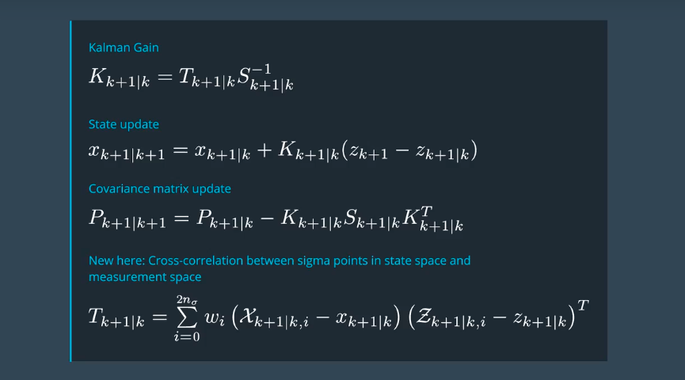

  c++示例代码：

  ```c++
  #include <iostream>
  #include "ukf.h"

  UKF::UKF() {
    //TODO Auto-generated constructor stub
    Init();
  }

  UKF::~UKF() {
    //TODO Auto-generated destructor stub
  }

  void UKF::Init() {

  }

  /*******************************************************************************
  * Programming assignment functions: 
  *******************************************************************************/

  void UKF::UpdateState(VectorXd* x_out, MatrixXd* P_out) {

    //set state dimension
    int n_x = 5;

    //set augmented dimension
    int n_aug = 7;

    //set measurement dimension, radar can measure r, phi, and r_dot
    int n_z = 3;

    //define spreading parameter
    double lambda = 3 - n_aug;

    //set vector for weights
    VectorXd weights = VectorXd(2*n_aug+1);
     double weight_0 = lambda/(lambda+n_aug);
    weights(0) = weight_0;
    for (int i=1; i<2*n_aug+1; i++) {  //2n+1 weights
      double weight = 0.5/(n_aug+lambda);
      weights(i) = weight;
    }

    //create example matrix with predicted sigma points
    MatrixXd Xsig_pred = MatrixXd(n_x, 2 * n_aug + 1);
    Xsig_pred <<
           5.9374,  6.0640,   5.925,  5.9436,  5.9266,  5.9374,  5.9389,  5.9374,  5.8106,  5.9457,  5.9310,  5.9465,  5.9374,  5.9359,  5.93744,
             1.48,  1.4436,   1.660,  1.4934,  1.5036,    1.48,  1.4868,    1.48,  1.5271,  1.3104,  1.4787,  1.4674,    1.48,  1.4851,    1.486,
            2.204,  2.2841,  2.2455,  2.2958,   2.204,   2.204,  2.2395,   2.204,  2.1256,  2.1642,  2.1139,   2.204,   2.204,  2.1702,   2.2049,
           0.5367, 0.47338, 0.67809, 0.55455, 0.64364, 0.54337,  0.5367, 0.53851, 0.60017, 0.39546, 0.51900, 0.42991, 0.530188,  0.5367, 0.535048,
            0.352, 0.29997, 0.46212, 0.37633,  0.4841, 0.41872,   0.352, 0.38744, 0.40562, 0.24347, 0.32926,  0.2214, 0.28687,   0.352, 0.318159;

    //create example vector for predicted state mean
    VectorXd x = VectorXd(n_x);
    x <<
       5.93637,
       1.49035,
       2.20528,
      0.536853,
      0.353577;

    //create example matrix for predicted state covariance
    MatrixXd P = MatrixXd(n_x,n_x);
    P <<
    0.0054342,  -0.002405,  0.0034157, -0.0034819, -0.00299378,
    -0.002405,    0.01084,   0.001492,  0.0098018,  0.00791091,
    0.0034157,   0.001492,  0.0058012, 0.00077863, 0.000792973,
   -0.0034819,  0.0098018, 0.00077863,   0.011923,   0.0112491,
   -0.0029937,  0.0079109, 0.00079297,   0.011249,   0.0126972;

    //create example matrix with sigma points in measurement space
    MatrixXd Zsig = MatrixXd(n_z, 2 * n_aug + 1);
    Zsig <<
        6.1190,  6.2334,  6.1531,  6.1283,  6.1143,  6.1190,  6.1221,  6.1190,  6.0079,  6.0883,  6.1125,  6.1248,  6.1190,  6.1188,  6.12057,
       0.24428,  0.2337, 0.27316, 0.24616, 0.24846, 0.24428, 0.24530, 0.24428, 0.25700, 0.21692, 0.24433, 0.24193, 0.24428, 0.24515, 0.245239,
        2.1104,  2.2188,  2.0639,   2.187,  2.0341,  2.1061,  2.1450,  2.1092,  2.0016,   2.129,  2.0346,  2.1651,  2.1145,  2.0786,  2.11295;

    //create example vector for mean predicted measurement
    VectorXd z_pred = VectorXd(n_z);
    z_pred <<
        6.12155,
       0.245993,
        2.10313;

    //create example matrix for predicted measurement covariance
    MatrixXd S = MatrixXd(n_z,n_z);
    S <<
        0.0946171, -0.000139448,   0.00407016,
     -0.000139448,  0.000617548, -0.000770652,
       0.00407016, -0.000770652,    0.0180917;

    //create example vector for incoming radar measurement
    VectorXd z = VectorXd(n_z);
    z <<
        5.9214,
        0.2187,
        2.0062;

    //create matrix for cross correlation Tc
    MatrixXd Tc = MatrixXd(n_x, n_z);

  /*******************************************************************************
   * Student part begin
   ******************************************************************************/

    //calculate cross correlation matrix
    Tc.fill(0.0);
    for (int i = 0; i < 2 * n_aug + 1; i++) {  //2n+1 simga points

      //residual
      VectorXd z_diff = Zsig.col(i) - z_pred;
      //angle normalization
      while (z_diff(1)> M_PI) z_diff(1)-=2.*M_PI;
      while (z_diff(1)<-M_PI) z_diff(1)+=2.*M_PI;

      // state difference
      VectorXd x_diff = Xsig_pred.col(i) - x;
      //angle normalization
      while (x_diff(3)> M_PI) x_diff(3)-=2.*M_PI;
      while (x_diff(3)<-M_PI) x_diff(3)+=2.*M_PI;

      Tc = Tc + weights(i) * x_diff * z_diff.transpose();
    }

    //Kalman gain K;
    MatrixXd K = Tc * S.inverse();

    //residual
    VectorXd z_diff = z - z_pred;

    //angle normalization
    while (z_diff(1)> M_PI) z_diff(1)-=2.*M_PI;
    while (z_diff(1)<-M_PI) z_diff(1)+=2.*M_PI;

    //update state mean and covariance matrix
    x = x + K * z_diff;
    P = P - K*S*K.transpose();

  /*******************************************************************************
   * Student part end
   ******************************************************************************/

    //print result
    std::cout << "Updated state x: " << std::endl << x << std::endl;
    std::cout << "Updated state covariance P: " << std::endl << P << std::endl;

    //write result
    *x_out = x;
    *P_out = P;
  }
  ```

  ​

- 如何选择噪声参数以及如何评估噪声参数

  > 测量噪声的参数可以查看传感器手册获得。处理过程中的噪声相对较复杂。
  >
  > 如下图，假设最大的加速度为6m/s2，取其1/2，求得噪声参数。
  >
  > 同时还可以考虑使路径更平滑，或使预测值更快的追上测量值，去调整噪声参数。

  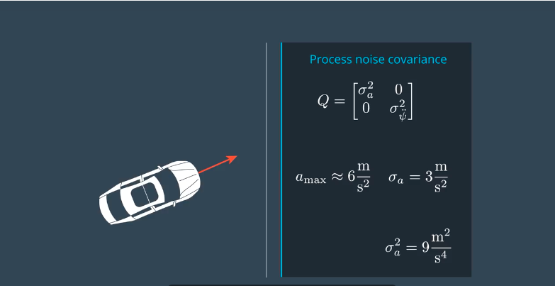		  

  > 评估噪声参数
  >
  > 测量值和预测值差距较大，有下面两种情况。
  >
  > 1. 系统低估了不确定性，估算的精度没有想象的那么高。

  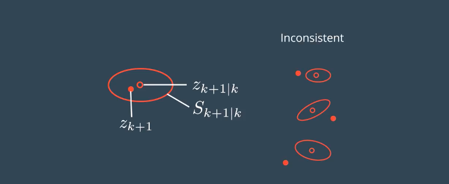

  > 2. 系统高估了不确定性，估算的精度比想象的高。

  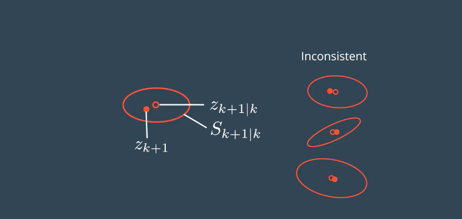

  > 使用NIS进行一致性检查，结果是一个标量。

  

  > NIS符合卡方分布
  >
  > 由下表可以看出有0.05的概率是大于7.815的。其中，df表示自由度，三维空间所以取3自由度。

  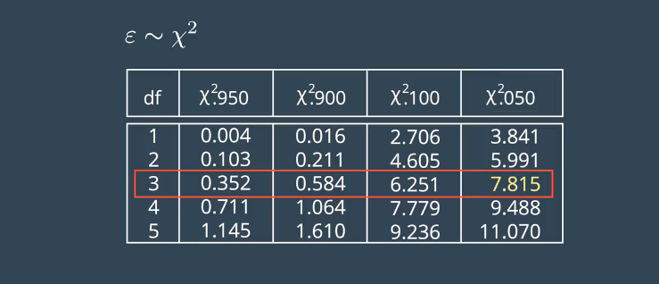

  > 因为NIS符合卡方分布，把每一次的运算结果就记录在如下的图形中，得到的结果是符合标准的。
  >
  > 但是，如果图像更多的在7.8之上，表示过高的估计了准确度，如果图像大部分都在7.8偏下表示过低的估计了准确度。需要通过调整参数。虽然没有指定应该怎么调参数，但是可以作为一个检验的标准。

  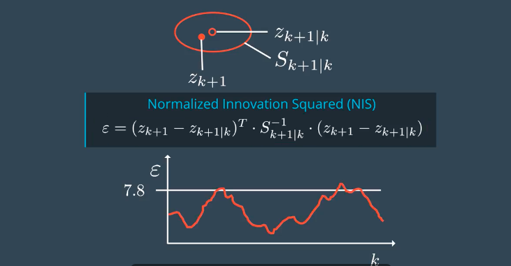

- 总结

  1. UKF可以获取速度和位置的平滑估计，不会引来延时。
  2. 传感器不能获取方向和角速度的前提下，可以估计其他测量方向和角速度。
  3. 估计结果的准确度。

  ​
